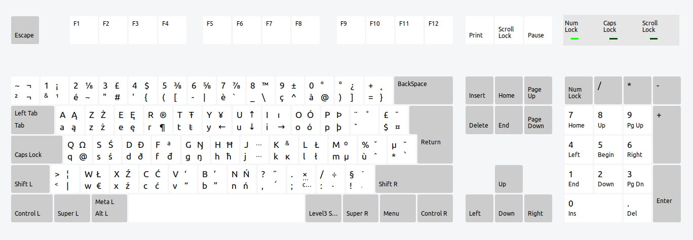

# XKeyboard Franco-Polish layout + Debian package example
This project contains a debian package that can be installed with `dpkg` or `apt` to add an AZERTY keyboard layout with Polish keys that looks like this:



(Extra characters are accessed by holding AltGr or AltGr+Shift)

This project also serves as an educational example of how to create a Debian package with an XKeyboard layout in it, including how to design the package so it can be uninstalled cleanly.

## Installing
If all you want is the layout, just download `franco-polish_1.0-1.deb` and install it by double clicking it, or from the command line with:

```
sudo apt install -f ./franco-polish_1.0-1.deb
```

Annoyingly, you seem to have to log out and in again after installing to make it work completely. I would love to know what to put in the `postinst` or elsewhere in the Debian package configuration to not have to do that.

To uninstall the package, just run `sudo apt remove franco-polish`.

> **Note:** I've tested this on my Ubuntu 19.04 machine and it works fine. I can't guarantee you it won't break your system in some way. This package modifies `/usr/share/X11/xkb/rules/evdev.xml` and `/usr/share/X11/xkb/symbols/pl`. Running `sudo apt remove franco-polish` should restore those files to their original state, but you should probably backup those files beforehand just in-case. This software is provided as-is et cetera et cetera.

## How to put an XKeyboard layout in a Debian package.
This project is also supposed to serve as an example for how to stick an XKeyboard layout in a Debian package. If this is what you're interested in, you should read the following tutorials first:

1. [How to create an XKeyboard layout](http://people.uleth.ca/~daniel.odonnell/Blog/custom-keyboard-in-linuxx11).
2. [How to create a Debian package](https://ubuntuforums.org/showthread.php?t=910717).

You should also read the tutorial on Debian package diversions linked below.

### Diversions
In order to create a custom keyboard layout, you need to modify two files in `/usr/share/X11/xkb`. If you try to make a basic Debian package to do this following the second link above, you'll find it can't be installed. `dpkg` will complain at you that your package can't overwrite files which belong to the XKeyboard package. To get around this, we need to use "[diversions](https://askubuntu.com/questions/1173862/can-i-create-an-uninstallable-debian-package-which-overwrites-another-packages/1173906#1173906)". A diversion is basically a rule that says "Hey `dpkg`, package `P` wants to modify file `F` that belongs to some other package. Make a backup of `F` called `B` and remember to restore `F` to its original state if the user uninstalls `P`". As a bonus, diversions mean that your packages changes will be undone cleanly if it's uninstalled.

### Browing this repository
This repository has two (important) commits. The [first commit](https://github.com/geajack/xkeyboard-franco-polish/commit/26b105656db4eea1bff823827ca4a7dca3acd079) is a Debian package which does nothing. Upon installing it, it overwrites the XKeyboard files with their original content, i.e. it doesn't actually change them. However, it does include the correct `preinst` and `postrm` scripts to set up diversions to enable a clean uninstall. This is just to show you the skeleton for how to create an XKeyboard layout Debian package.

The [second commit](https://github.com/geajack/xkeyboard-franco-polish/commit/02aa7ae2c186d09e0222a5923878cdebe7fe193e) adds the changes necessary to actually add the new keyboard layout. By looking at the diff, you can see exactly what changes are necessary.